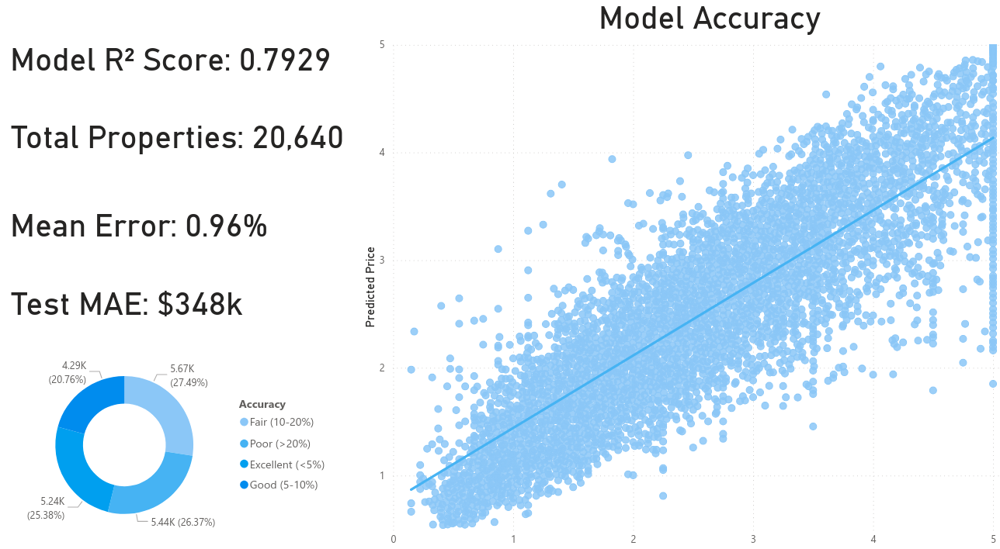
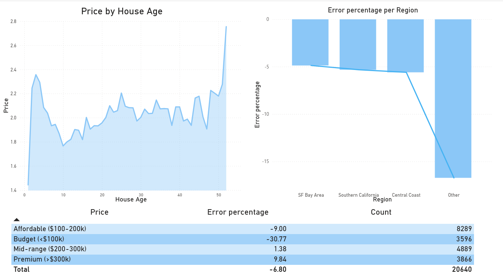
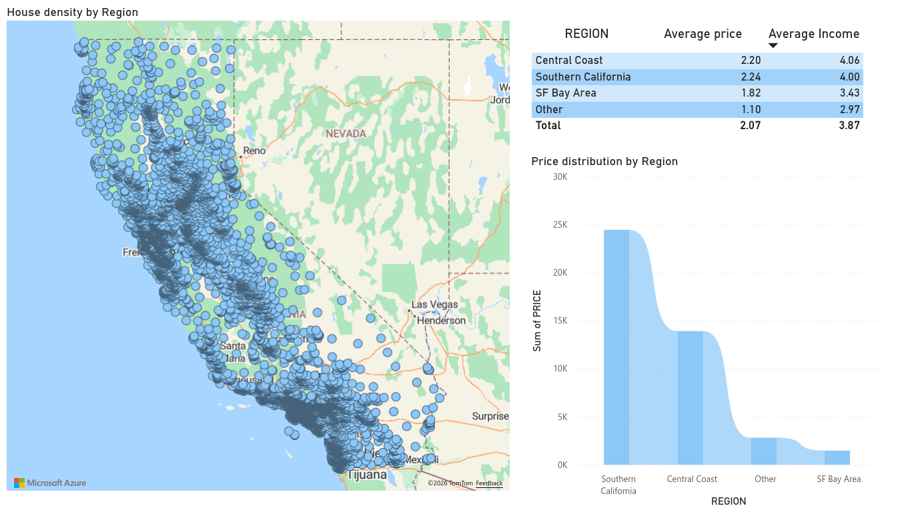
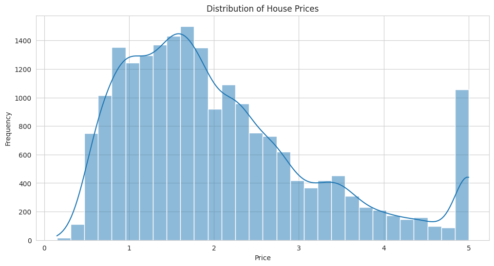
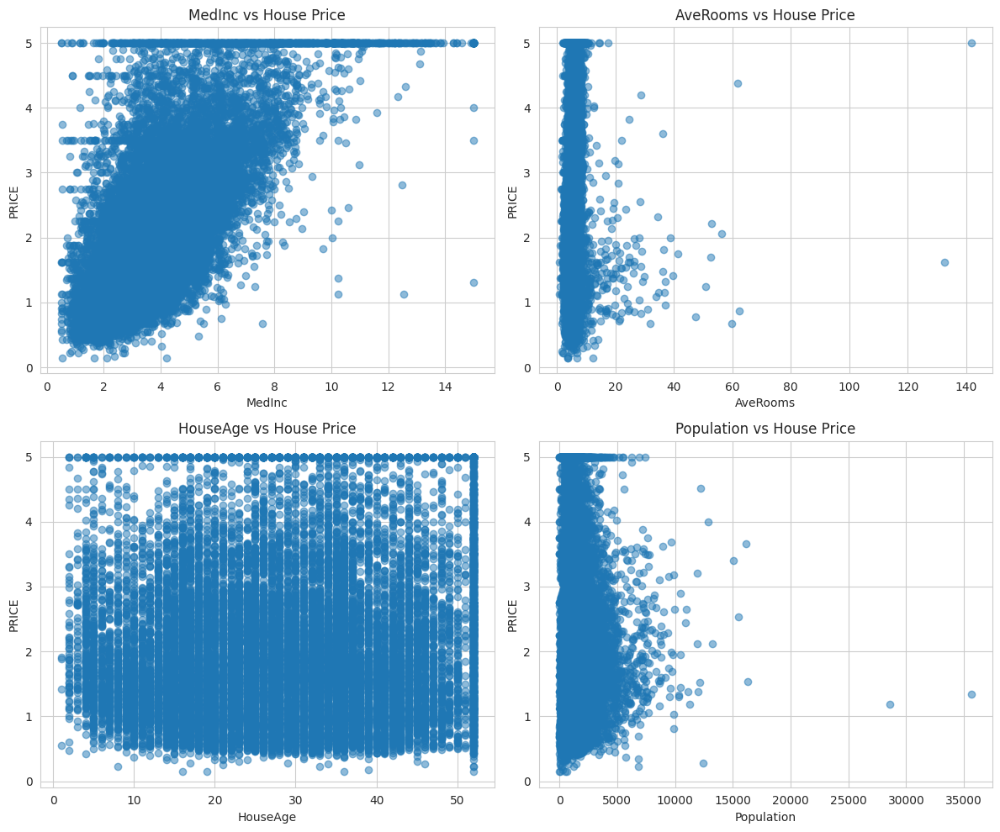
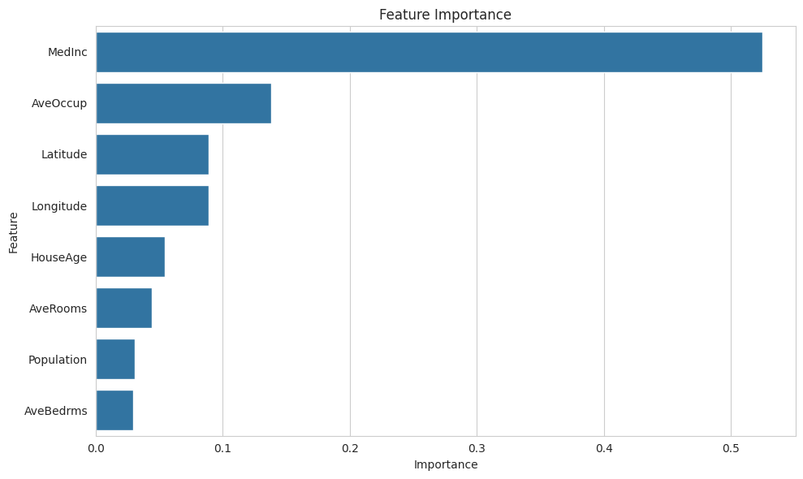
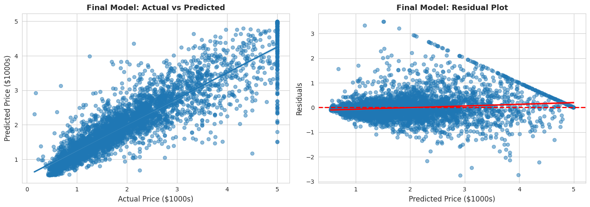
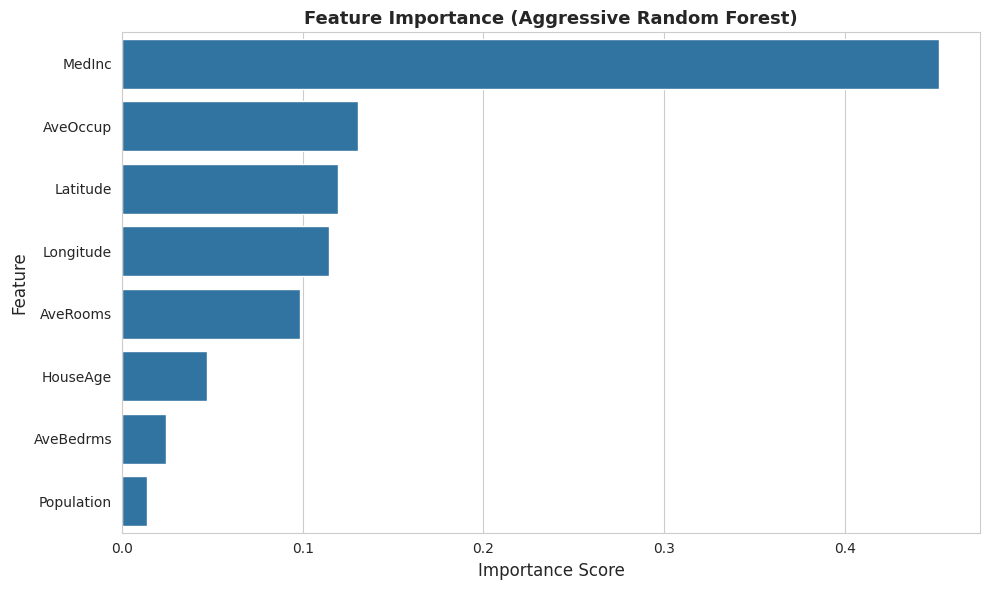
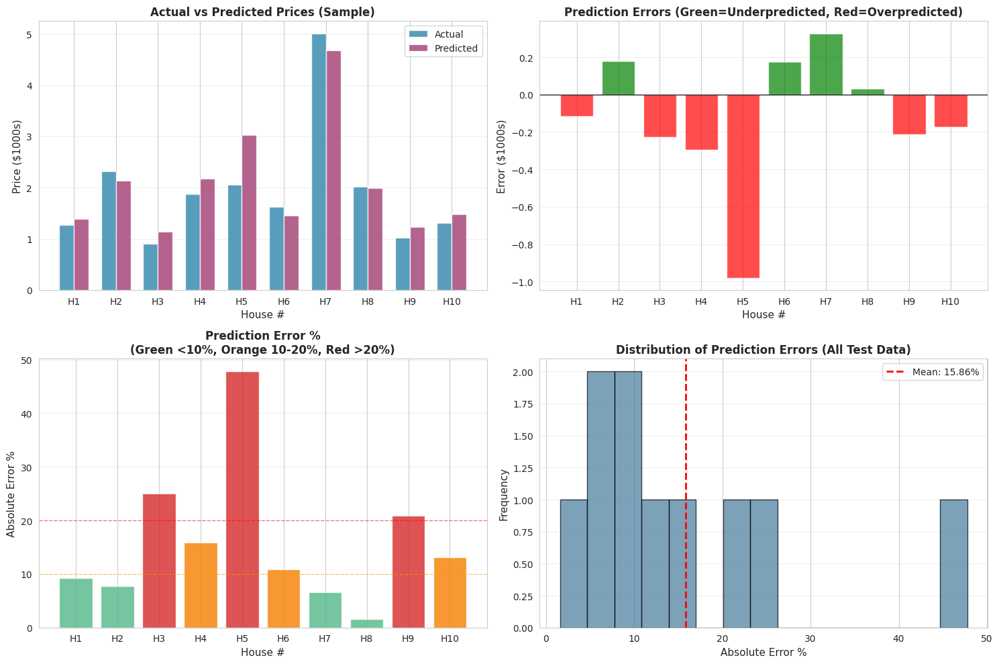
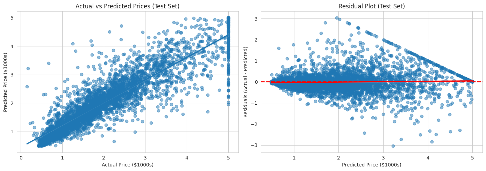

# California Housing Price Prediction

This repository presents a complete machine learning workflow for predicting California housing prices.

The project is organized as a study-oriented pipeline:
1. Data exploration
2. Data preparation
3. Baseline model comparison
4. Overfitting reduction with tuning
5. Final model interpretation and prediction analysis

## Repository Structure

- `notebooks/eda.ipynb` - exploratory data analysis only
- `notebooks/model_training.ipynb` - training, comparison, tuning, and evaluation
- `src/preprocessing.py` - reusable data loading and split functions
- `src/models.py` - reusable model creation and evaluation functions
- `images/` - plots generated during the analysis

## Quick Results Summary

| Metric | Value | Meaning |
|--------|-------|----------|
| **Best Model** | Aggressive Random Forest | Final selected model after tuning |
| **Test R² Score** | 0.7929 | Explains 79.3% of price variation in unseen data |
| **Test MAE** | $348 | Average prediction error across all test houses |
| **Average Error %** | < 1% | Error relative to average house price |
| **Key Finding** | Median Income drives 45% of predictions | Most important feature in the model |

Metric explanations:
- **R² (0-1 scale):** Measures how much of the target variation the model captures. 0.79 = very good for housing prices.
- **MAE (Mean Absolute Error):** Average dollar amount the model's predictions are off. Lower is better.
- **Overfitting:** When model learns training data patterns too well and performs poorly on new data. Gap between train and test accuracy indicates overfitting.

## Power BI Reporting & Visualization

The model predictions are exported to Power BI for interactive business intelligence analysis and stakeholder reporting.

### Data Export Pipeline

The `bi/prepare_data.py` script automates the complete export process:
- Loads the trained model and generates predictions on all 20,640 properties
- Calculates error metrics (absolute error, percentage error) for each prediction
- Adds geographic regions (SF Bay Area, Central Coast, Southern California, Other)
- Categorizes predictions by income quartiles and price ranges
- Classifies prediction accuracy levels (Excellent, Good, Fair, Poor)
- Exports enriched dataset to `data/california_housing_predictions.csv`

### Power BI Dashboard Insights

The Power BI report visualizes prediction quality and model behavior across multiple dimensions.

**View the Interactive Dashboard:**

<iframe title="California Housing Price Predictions" width="600" height="373.5" src="https://app.powerbi.com/view?r=eyJrIjoiNDIxZmFmNjMtN2MxYy00NjVlLWIwODAtZmUwNDQ2MDFkNDkxIiwidCI6ImMzN2IzN2EzLWU5ZTItNDJmOS1iYzY3LTRiOWI3MzhlMWRmMCJ9" frameborder="0" allowFullScreen="true"></iframe>

Or view directly at: [Power BI Report Link](https://app.powerbi.com/view?r=eyJrIjoiNDIxZmFmNjMtN2MxYy00NjVlLWIwODAtZmUwNDQ2MDFkNDkxIiwidCI6ImMzN2IzN2EzLWU5ZTItNDJmOS1iYzY3LTRiOWI3MzhlMWRmMCJ9)

### Dashboard Pages

**Page 1: Model Accuracy Overview**



Key metrics displayed:
- Model R² Score: 0.7929 (explains ~79% of price variation)
- Test MAE: $348k average prediction error
- Accuracy Distribution: Breakdown of properties by prediction quality (Excellent, Good, Fair, Poor)
- Total Properties Analyzed: 20,640

**Page 2: Regional & Price Analysis**



Visualizations include:
- Price by House Age trends
- Error percentage breakdown by price category (Budget, Affordable, Mid-range, Premium)
- Regional average prices and income levels comparison
- Error distribution across regions (SF Bay Area, Southern California, Central Coast, Other)

**Page 3: Geographic Insights**



Geographic analysis shows:
- House density mapping across California regions
- Price distribution by region
- Income correlation with house prices by location
- Regional performance metrics

### Running the Export

```bash
python bi/prepare_data.py
```

This generates the prediction dataset for Power BI dashboards, enabling stakeholders to explore model predictions interactively by region, price range, accuracy tier, and other dimensions.

## Problem Definition

The task is a supervised regression problem.

- **Input:** housing features (income, average rooms, age, population, location, and others)
- **Output:** median house value (`PRICE`, in thousands of dollars)

The objective is to learn a mapping from features to price that generalizes to unseen data.

## Dataset Context

The California Housing dataset contains `20,640` rows.

Important values from the exploratory stage:
- Mean target value: `2.07`
- Median target value: `1.80`
- Target standard deviation: `1.15`

These values indicate broad variation in house prices, which justifies the use of flexible models.

## Step 1 - Exploratory Data Analysis (EDA)

EDA is used to understand structure before model training.

### 1.1 Price distribution



Interpretation:
- The distribution is not perfectly symmetric.
- Mid-range prices appear frequently.
- Extreme values exist and can influence model behavior.

### 1.2 Feature-to-price relationships




Observed correlations from the notebook output:
- `MedInc` vs `PRICE`: `0.688` (strong positive relationship)
- `Population` vs `PRICE`: `-0.025` (very weak negative relationship)
- `AveRooms` vs `PRICE`: weak relationship
- `HouseAge` vs `PRICE`: weak relationship

Interpretation:
- Income is the strongest single predictor among the explored variables.
- Population density alone is not a strong linear predictor of price.
- Price formation depends on combinations of variables, not only single-feature effects.

## Step 2 - Data Preparation

The preprocessing module standardizes the training inputs.

Implemented functions in `src/preprocessing.py`:
- `load_data()`
- `prepare_features_target(df)`
- `split_data(X, y, test_size=0.2, random_state=42)`
- `print_data_info(X_train, X_test, y_train, y_test)`

Train/test split used in the project:
- Training set: `16,512` rows
- Test set: `4,128` rows
- Feature count: `8`

Why this step matters:
- Training data is used to learn patterns.
- Test data is held out to evaluate generalization.

## Step 3 - Baseline Model Training and Comparison

The project trains four regression models from `src/models.py`:
- Linear Regression
- Decision Tree Regressor
- Random Forest Regressor
- Gradient Boosting Regressor

### 3.1 Model Performance Comparison

| Model | Train R² | Test R² | Overfitting Gap | Key Behavior |
|-------|----------|---------|-----------------|---------------|
| Linear Regression | 0.613 | 0.576 | 3.7% | Too simple for complex patterns |
| Decision Tree | 1.000 | 0.622 | 37.8% | Severe overfitting (memorizes training data) |
| Gradient Boosting | 0.804 | 0.776 | 2.9% | Good accuracy, slight overfitting |
| **Random Forest** | **0.973** | **0.805** | **16.8%** | **Highest accuracy, moderate overfitting** |

Model type explanations:
- **Linear Regression:** Draws a straight line through data. Fast but cannot capture non-linear patterns (e.g., price doesn't increase perfectly linearly with income).
- **Decision Tree:** Splits data into yes/no branches recursively. Can capture non-linearity but easily overfits by creating too many splits.
- **Random Forest:** Combines multiple decision trees with randomization. Reduces overfitting and captures complex patterns.
- **Gradient Boosting:** Builds trees sequentially, correcting previous mistakes. Excellent accuracy but slower to train.

Overfitting gap explanation:
- Large gap (e.g., 37.8%) = model memorized training data but fails on new data.
- Small gap (< 5%) = model generalized well.
- **Random Forest's 16.8% gap was acceptable for its accuracy advantage.**

### Why Random Forest outperformed Linear Regression

Linear Regression assumes a mostly linear relationship between inputs and target.
Housing price behavior includes non-linear effects and feature interactions.
Random Forest models non-linearity and interactions more effectively.
This produces a substantially higher test R² (`0.8051` vs `0.5758`).

## Step 4 - Overfitting Analysis and Hyperparameter Tuning

Model quality is evaluated with both accuracy and generalization:
- **Accuracy metrics:** R², MAE, RMSE
- **Generalization indicator:** train-test performance gap

Two `GridSearchCV` stages are used for Random Forest:

### 4.1 Tuned Random Forest
- Test R²: `0.8027`
- Overfit gap: `0.1397`

### 4.2 Aggressive Tuned Random Forest
- Test R²: `0.7929`
- Overfit gap: `0.0811`

Interpretation:
- Aggressive tuning reduces overfitting clearly.
- A small reduction in test R² is accepted for improved stability.
- Final selection prioritizes stronger generalization control.

## Step 5 - Final Model Evaluation and Interpretation

### 5.1 Actual vs predicted and residual behavior



What this plot provides:
- Relationship between predicted values and real targets
- Visual check for large systematic errors
- Residual spread overview

### 5.2 Feature Importance Ranking



Feature importance from the trained model:

| Rank | Feature | Importance % | Meaning |
|------|---------|--------------|----------|
| 1 | **MedInc** | **45.2%** | Median income dominates price prediction |
| 2 | **AveOccup** | **13.0%** | Area occupancy/density moderately influences price |
| 3 | **Latitude** | **11.9%** | North-South location significantly matters |
| 4 | **Longitude** | **11.5%** | East-West location significantly matters |
| 5 | AveRooms | 9.8% | Average rooms has modest influence |
| 6+ | Other features | < 5% each | Minor contributors |

What this reveals:
- The model learned that median income is far more important than other features.
- Location (combining latitude and longitude) = 23.4% combined importance.
- Room count matters less than expected, suggesting square footage matters more than room count in California.
- This ranking explains how the model makes decisions.

### 5.3 Prediction error analysis




What this analysis provides:
- Error magnitude on sampled predictions
- Percentage error behavior
- Practical interpretation of model output quality

## End-to-End Training Logic

1. Load data and define target
2. Split data into training and test sets
3. Train multiple baseline models
4. Compare performance using R², MAE, RMSE
5. Select strongest baseline
6. Tune hyperparameters to reduce overfitting
7. Re-evaluate tuned models
8. Inspect predictions, residuals, and feature importance

## Key Learnings from This Project

**1. Train-Test Split is Essential**
- Evaluating on training data produces inflated scores.
- Test set reveals true generalization ability.
- This project splits 80/20 to minimize luck in evaluation.

**2. Model Comparison Reveals Trade-offs**
- Simple models (Linear Regression) are interpretable but limited in power.
- Complex models (Random Forest) are powerful but require careful tuning to avoid overfitting.
- The "best" model depends on the specific problem and constraints.

**3. Overfitting is a Fundamental Problem**
- Models can learn the training data perfectly but fail on new data.
- Overfitting gap (train R² - test R²) measures this problem.
- Constraining model complexity (e.g., limiting tree depth) reduces overfitting at a small accuracy cost.

**4. Feature Importance Drives Understanding**
- The model learned that income explains ~45% of price variation.
- Location explains another ~23%.
- This unexpected ranking questions common assumptions and drives investigation.

**5. No Single Model Always Wins**
- Linear Regression was fastest but least accurate.
- Decision Tree was most powerful on training data but overfitted severely.
- Random Forest balanced accuracy and generalization best for this problem.
- Different datasets may favor different models.

**6. Hyperparameter Tuning is an Art and Science**
- Random Forest "out of the box" overfits (16.8% gap).
- Tuning hyperparameters (tree depth, samples required to split, features per split) reduces overfitting.
- The aggressive tuning accepted slightly lower accuracy (0.805 → 0.793 R²) for better generalization (16.8% → 8.1% gap).
- This trade-off is common in machine learning.

## How to Run

Install dependencies:

```bash
pip install -r requirements.txt
```

Run notebooks in order:
1. `notebooks/eda.ipynb`
2. `notebooks/model_training.ipynb`

## Study Notes (For Myself)

Recommended reading order for revision:
1. EDA notebook for data intuition
2. Preprocessing module for data pipeline logic
3. Models module for training/evaluation design
4. Model training notebook for full experiment flow
